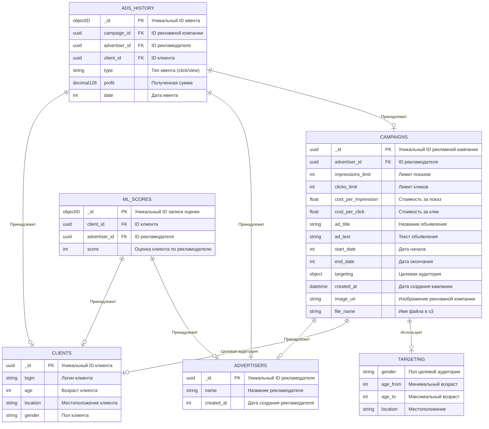

# PROD Backend 2025 Advertising Platform API

## Инструкция по сборке проекта

#### 1. Настройка окружения

Перед началом сборки проекта необходимо скопировать настройки из примера в основной файл `.env`.

<details>
  <summary>В рамках задания все секреты уже прописаны в .env и этот шаг можно пропустить</summary>
  1. Скопируйте настройки из `.env.example` в новый файл `.env`:

   ```bash
   cp .env.example .env
   ```

2. Если требуется, отредактируйте `.env`, чтобы настроить параметры для вашего окружения.
</details>

#### 2. Сборка с использованием Docker

Для быстрого старта проекта можно использовать Docker с Docker Compose. Для этого выполните следующие шаги:

1. Убедитесь, что у вас установлен Docker и Docker Compose.

2. Запустите контейнеры с помощью команды:

   ```bash
   docker-compose up -d
   ```

3. После этого все необходимые сервисы (Redis, MongoDB, MinIO) будут подняты и запущены.

#### 3. Сборка бекенда без Docker (локальная установка)

Если вы хотите запустить проект без использования Docker, выполните следующие шаги:

#### 3.1. Запуск сервисов

Необходимо установить и запустить следующие сервисы вручную:

- **Redis** — используйте официальный Docker образ или установите Redis напрямую.
- **MongoDB** — скачайте и установите MongoDB.
- **MinIO** — скачайте и установите MinIO или любой другой S3-совместимый сервис.

#### 3.2. Установка Golang

1. Скачайте и установите Go версии >1.23.5
2. Убедитесь, что Go корректно установлен:

   ```bash
   go version
   ```

#### 3.3. Установка зависимостей и запуск

1. Перейдите в папку `backend`:

   ```bash
   cd backend
   ```

2. Скачайте зависимости:

   ```bash
   go mod tidy
   ```

3. Запустите проект:

   ```bash
   go run cmd/main.go
   ```
   
#### 4. В бекенде присутствуют Unit и e2e есты, для их запуска:
1. Перейдите в папку `backend`:

   ```bash
   cd backend
   ```
2. Скачайте зависимости:

   ```bash
   go mod tidy
   ```
3. Запустите тесты:

   ```bash
   go test .\tests\
   ```

#### Примечания

- Перед запуском тестов Redis и MongoDB должны быть пустыми
- Убедитесь, что все сервисы (Redis, MongoDB, MinIO) работают корректно перед запуском backend.
- Для настройки, не забудьте указать правильные ключи доступа в `.env`.
- При использовании Docker все сервисы автоматически настраиваются, и вам не нужно запускать их вручную.

## Описание [docker-compose.yml (кликабельно)](./docker-compose.yml)
1. **backend** 📱:
    - Собирается из директории backend.
    - Экспонирует порт 8080 на хосте и внутри контейнера.
    - Использует переменные окружения для подключения к MongoDB, Redis, MinIO.
2. **mongodb** 🗄️:
    - Использует официальный образ `mongo:latest`.
    - Экспонирует порт 27017 для подключения к базе данных.
    - Настроен с пользователем и паролем для инициализации.

3. **redis** 📁:
   - Использует официальный образ `redis:7.4`.
   - Экспонирует порт 6379 для подключения.
   - Предназначен кеширования будущих реклам для пользователя, ml скоров и для хранения текущего дня

4. **minio** 🗄️:
   - Использует официальный образ `minio/minio`.
   - Экспонирует порт 9000 для подключения api и 9001 для ui интерфейса.
   - Предназначен для хранения изображений рекламных кампаний.
5. **grafana** 📈:
   - Использует официальный образ `grafana/grafana:latest`.
   - Экспонирует порт 3000 для ui интерфейса.
   - Предназначена для визуализации статистики.

6. **bot** 🤖:
   - Собирается из директории bot.
   - Запускается по ссылке https://t.me/advertising_platform_prod_bot
   - Предназначен для демонстрации функционала.

## Спецификация (Описание работы основных точек входа)
Все доступные эндпоинты можно посмотреть по ссылке `http://localhost:8080/docs/index.html` после запуска сервера, либо в файле [swagger.yaml (кликабельно)](./backend/pkg/docs/swagger.yaml)

Список эндпоинтов:
> 

## Описание СУБД


## Описание интеграции со сторонними решениями.
### MongoDB
MongoDB была выбрана для данного проекта по нескольким причинам, которые делают её отличным выбором в контексте работы с большим количеством данных и гибкостью при изменении структуры данных.
#### 1. **Высокая производительность**
MongoDB оптимизирована для обработки большого объема данных и может обрабатывать запросы быстрее, чем реляционные базы данных.
#### 2. **Масштабируемость**
MongoDB поддерживает горизонтальное масштабирование, благодаря чему можно легко распределить нагрузку между несколькими серверами. Это идеально подходит для растущих приложений, которым требуется поддержка большого объема данных и высокой нагрузки.
#### 3. **Быстрая разработка**
В MongoDB отсутствует необходимость в сложной нормализации данных, как в реляционных базах данных, что ускоряет процесс разработки и тестирования, делая её отличным выбором для данного проекта.

### Redis
Redis используется для кеширования рекламных данных, ML-оценок и хранения информации о текущем дне. Это повышает скорость взаимодействия с сервером, ускоряя обработку запросов и снижая нагрузку на базу данных.

### MinIO
MinIO выбран для хранения рекламных изображений. Он обеспечивает высокую доступность и масштабируемость хранения объектов, идеально подходя для работы с большим количеством файлов.

### Grafana
Я выбрал Grafana, потому что это мощный инструмент для визуализации данных, который поддерживает интеграцию с различными источниками данных и предоставляет гибкие возможности для создания информативных и настраиваемых дашбордов. Он удобен в использовании и помогает эффективно анализировать данные в реальном времени.

### GigaChat
Используется для генерации рекламных текстов. Выбрана она из-за предоставления начальных токенов, но легко может замениться на другую.
Токен, получаемый для запросов кешируется в redis.

### OpenAI
Используется для модерации текстов и названий рекламных кампаний. Выбран из-за простоты использования.
- Недоступен для запуска из РФ :(

## Как работает алгоритм получения рекламы?
Для уменьшения количества строк кода созданы функции
#### `CalculateCampaigns`:
1. Инициализация переменных: `wg` (WaitGroup), `bestCampaigns` (слайс для хранения лучших кампаний)
2. Цикл по кампаниям (`for _, campaign := range campaigns`)
   - Добавить задачу в `WaitGroup` (wg.Add(1))
   - Запуск горутины для обработки каждой кампании:
      - Получить значение `dbScore` из кеша по client ID и advertiser ID
      - Рассчитать новый `score` для кампании через функцию `CalculateCampaignScore`, код расчета в [этом файле](./backend/pkg/campaign/campaign.go)
      - Добавить кампанию в список `bestCampaigns`
3. Ожидание завершения всех горутин (wg.Wait())
4. Сортировка списка `bestCampaigns` по убыванию `Score`

#### `CheckCampaigns`:
1. Инициализация переменной `maxScoreCampaign`
2. Цикл по кампаниям (`for i, campaign := range campaigns`)
   - Получить просмотры и клики для каждой кампании из бд
   - Если кампания не удовлетворяет полностью условиям тз, пропустить её
   - Если компания уже просмотрена пользователем или кликнута или там закончились просмотры
     - Проверить, является ли текущая кампания лучшей, если да — сохранить её как `maxScoreCampaign`
   - Если все хорошо, то вернуть первую компанию максимально подходящую под условия
   - Сохранить остальные компании в кеш
3. Если цикл завершён без результата, сбросить кеш 

#### Функция, отвечающая на сам endpoint:
1. Проверяет валидность client ID и получает текущий день из кеша
2. Если в кеше есть записи, то запускаем проверку через функцию `CheckCampaigns` и из нее возвращаем лучшую кампанию
3. Если такой кампании нет или кеш пустой, то получаем из бд все кампании, подходящие по таргетингу и статистику по максимальным и минимальным параментрам цены и тд
4. Считаем для каждой кампании score через функцию `CalculateCampaigns`
5. Возвращаемся к пункту 2, но там после неудачной попытки мы уже возвращаем ошибку 404

### Долнительный функционал
По этому readme были раскиданы некоторые экстрафичи. Но тут я собрал их всех вместе:

1. Генерация текстов для рекламных компаний
   - Запустите сервер 
   - Перейдите на url спецификации (`/docs/index.html`)
   - Перейдите в метод `/ai/text/generate`
   - Отправьте post запрос
      - Body:
         - `title` - название рекламируемого товара
         - `wishes` - пожелания для рекламного текста
         - `location`, `gender` - не обязательные параметры для конкретизации запроса
   - В ответ вам вернется сгенерированный текст от GigaChat
   - Работу с GigaChat api можно посмотреть [тут](./backend/internal/repository/giga_chat.go)

   Демонстрация работы:
   
   > 
   > 

2. Визуализация статистики
   - Можно открыть по ссылке, когда смотришь рекламную кампанию в боте 
   - Dashboard со статистикой по рекламным компаниям доступен по ссылке `http://localhost:3000/d/fedpld5y7gruob/advertising-platform-dashboard`
   - Перед отображением графиков нужно вставить параметры advertiserID и campaignID (campaignID можно не устанавливать, если нужна статистика только по рекламодателю), если переходите на сайт не через бота

   Демонстрация работы:
   
   > 
   
3. Модерация рекламных текстов и их названий
   - К сожалению, из РФ нельзя получить доступ к OpenAI, поэтому нужно совершить небольшой перелет в другую страну, чтобы протестировать этот функционал
   - Запустите сервер
   - Перейдите на url спецификации (`/docs/index.html`)
   - Перейдите в метод `/ai/text/moderate`
   - - Отправьте post запрос
   - Body:
      - `status`: `true` (`true` - включить модерацию, `false` - выключить модерацию)
   - Перейдите в метод `/advertisers/bulk` и зарегистрируйте рекламодателя
   - Перейдите в метод `/advertisers/{advertiserID}/campaigns` [POST]
   - Создайте валидную рекламу, но с разжиганием ненависти в тексте и получите 422 Ошибку
   - Модерация работает и в методе обновления рекламной кампании   

   Демонстрация работы:
   
   > 
   > 
   
4. Добавление изображений в рекламных объявлениях
   - Для тестирования этого функционала понадобится postman или его альтернативы
   - Экспортируйте [swagger.yaml (кликабельно)](./backend/pkg/docs/swagger.yaml) в postman
   - Создайте валидный post запрос по спецификации `/advertisers/{advertiserID}/campaigns` [POST] используя `form-data`
   - Передайте в `form-data` `image_file` изображение для рекламной кампании
   - Теперь во всех методах с получением этой рекламной кампании будет отправляться эта ссылка
   - Так-же возможен альтернативный метод, прикрепление уже готовой ссылки в параметре `image_url`
   - Добавление изображений работает и в методе обновления рекламной кампании
   - Одновременно передать image_url и image_file нельзя
   - Максимальный размер image_file - 25 Мб.

   Демонстрация работы:

   > 
   > 

5. Тг бот
   - Запускается через docker compose, взаимодействует с локальным API
   - Доступен по ссылке https://t.me/advertising_platform_prod_bot

   Демонстрация работы:

   > [Видео с демонстрацией](./media/tg_bot_demo.mp4)